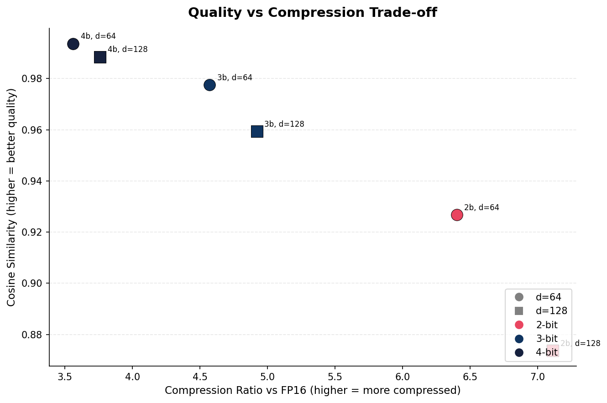
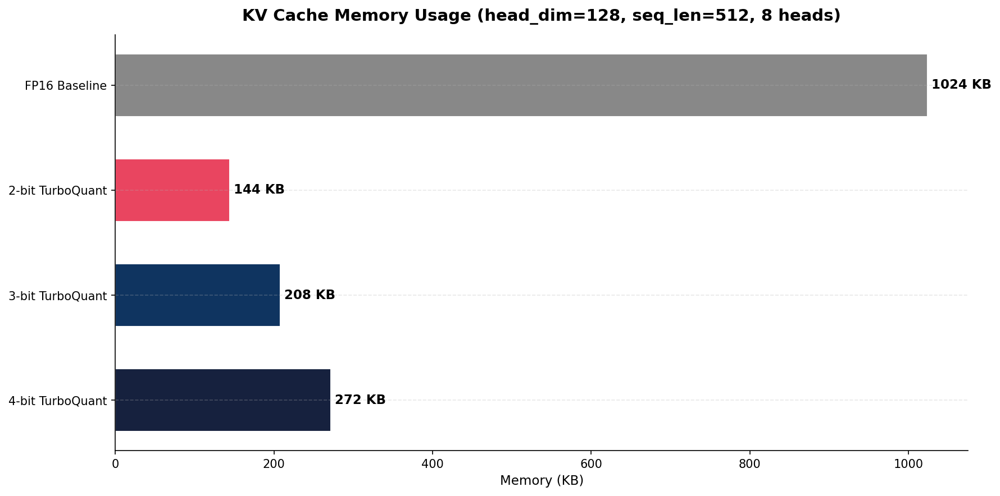
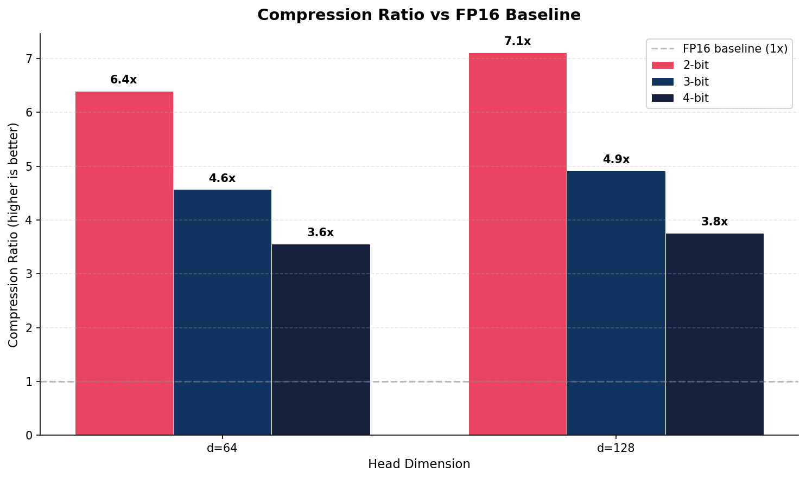
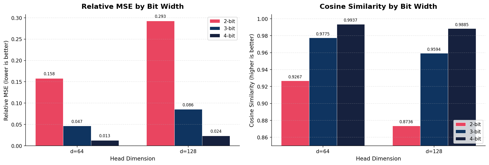
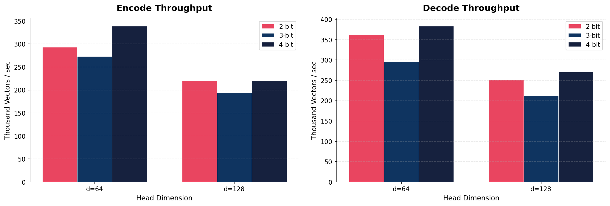
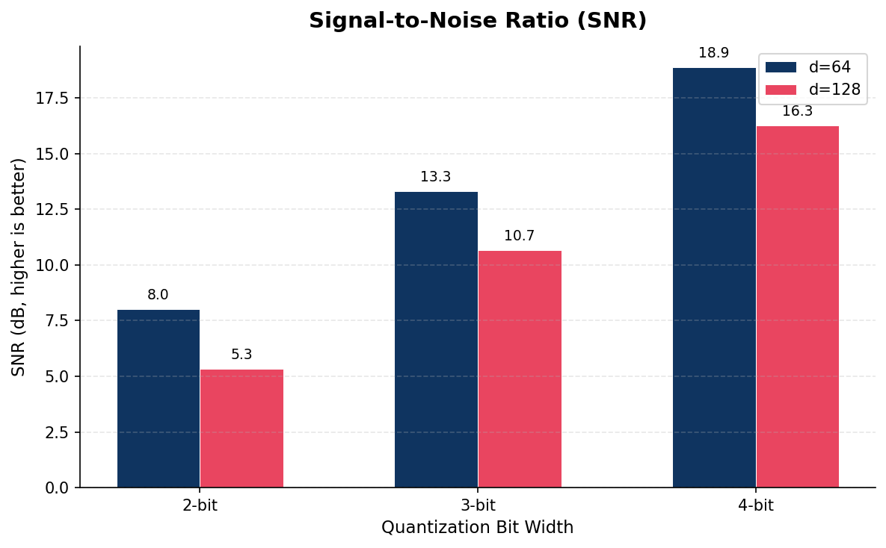

# TurboQuantKV

A Python implementation of the [TurboQuant](https://research.google/blog/turboquant-redefining-ai-efficiency-with-extreme-compression/) paper (Google Research, ICLR 2026) for extreme KV cache compression in LLM inference.

TurboQuantKV compresses the key-value cache to 2-4 bits per value with minimal accuracy loss, achieving **3-7x memory reduction** over FP16 with no calibration data or fine-tuning required. At 4-bit, cosine similarity exceeds **0.988** across all tested head dimensions. It works as a drop-in replacement for HuggingFace transformers' `DynamicCache`.

**Author:** [mchintan](https://github.com/mchintan)

---

## Benchmark Results

All benchmarks were run on synthetic and real data across multiple configurations. The graphs below summarize TurboQuantKV's performance characteristics.

### Quality vs Compression Trade-off

The fundamental trade-off: higher bit widths preserve more quality, while lower bit widths compress more aggressively. TurboQuantKV achieves **>0.98 cosine similarity at 4-bit** and **>0.87 at 2-bit** (higher with smaller head dimensions).



### Memory Savings

KV cache memory comparison for a realistic configuration (head_dim=128, seq_len=512, 8 attention heads). TurboQuantKV reduces memory by **3.8x-7.1x** compared to FP16 storage.



### Compression Ratio vs FP16 Baseline

Compression ratio scales favorably with head dimension. Larger models (head_dim=128) achieve even better ratios because the norm overhead becomes relatively smaller.



### Reconstruction Quality

Relative MSE and cosine similarity across bit widths and head dimensions. 4-bit quantization preserves **>98.8% cosine similarity** across all tested configurations.



### Encode/Decode Throughput

TurboQuantKV processes **200K-380K vectors/sec** on CPU, with 4-bit being the fastest due to simpler bitpacking.



### Signal-to-Noise Ratio

SNR ranges from **5-8 dB at 2-bit** to **16-19 dB at 4-bit**, consistent with theoretical predictions for Lloyd-Max quantization on the post-rotation Beta distribution.



---

## How It Works

TurboQuant uses a two-stage compression pipeline:

### Stage 1: PolarQuant

1. **Extract the norm** of each KV vector and **normalize** to a unit vector
2. **Rotate** the unit vector using the Walsh-Hadamard Transform (WHT), a fast orthogonal rotation applied in blocks (O(d log b) per vector, where b is block size)
3. After rotation, all coordinates become nearly identically distributed — specifically, each squared coordinate follows a Beta(0.5, (d-1)/2) distribution — this is a property of high-dimensional geometry
4. **Scalar quantize** each coordinate independently using Lloyd-Max optimal centroids precomputed from the known distribution
5. Store the **quantized indices** (2-4 bits per coordinate) and the **vector norm** (float32)

The key insight: because the post-rotation distribution is mathematically known, the quantizer centroids are optimal without any calibration data.

### Stage 2: QJL (Optional)

The Quantized Johnson-Lindenstrauss step corrects systematic bias in attention scores. When enabled, QJL is applied to **keys only** (values don't need bias correction for attention score estimation):

1. Compute the quantization **residual** (difference between original and reconstructed key vector)
2. Project through a random Rademacher matrix (+1/-1) and store only the **signs** (1 bit each)
3. At inference, use these signs to compute an unbiased correction to attention scores

QJL is disabled by default — empirical results show the MSE-only approach (PolarQuant alone) often performs better at low bit budgets because QJL adds variance that softmax amplifies.

---

## Quick Start

### Installation

```bash
pip install torch transformers
pip install -e .
```

### Basic Usage

```python
import torch
from transformers import AutoModelForCausalLM, AutoTokenizer
from turboquantkv import TurboQuantCache, TurboQuantConfig

# Load any HuggingFace model
model = AutoModelForCausalLM.from_pretrained("Qwen/Qwen2-0.5B", torch_dtype=torch.float16, device_map="auto")
tokenizer = AutoTokenizer.from_pretrained("Qwen/Qwen2-0.5B")

# Create TurboQuant compressed cache
config = TurboQuantConfig(key_bits=4, value_bits=3)
cache = TurboQuantCache(config=model.config, quant_config=config)

# Generate — just pass the cache as past_key_values
inputs = tokenizer("The future of AI is", return_tensors="pt").to(model.device)
outputs = model.generate(**inputs, past_key_values=cache, max_new_tokens=100, do_sample=False)
print(tokenizer.decode(outputs[0], skip_special_tokens=True))
```

### One-Line Helper

```python
from turboquantkv import TurboQuantConfig, generate_with_turboquant

config = TurboQuantConfig(key_bits=4, value_bits=3)
outputs = generate_with_turboquant(model, input_ids, quant_config=config, max_new_tokens=100)
```

### Measuring Memory Savings

```python
cache = TurboQuantCache(config=model.config, quant_config=TurboQuantConfig(key_bits=3, value_bits=3))
with torch.no_grad():
    model(**inputs, past_key_values=cache)

mem = cache.get_memory_bytes()
print(f"Compressed KV cache: {mem['compressed'] / 1024:.1f} KB")
```

---

## Configuration

```python
TurboQuantConfig(
    key_bits=4,           # Bits for key quantization: 2, 3, or 4
    value_bits=4,         # Bits for value quantization: 2, 3, or 4
    rotation_type="wht",  # "wht" (Walsh-Hadamard) or "random" (orthogonal matrix)
    block_size=32,        # WHT block size (power of 2, must divide head_dim)
    use_qjl=False,        # Enable QJL residual correction (keys only)
    qjl_dim=64,           # Number of QJL random projections
    seed=42,              # Random seed for reproducibility
)
```

**Recommended configurations:**

| Use Case | Config | Compression | Cosine Sim | Notes |
|----------|--------|-------------|-----------|-------|
| Quality-first | `key_bits=4, value_bits=4` | ~3.5-3.8x | >0.988 | Minimal accuracy loss |
| Balanced | `key_bits=4, value_bits=3` | ~4x | ~0.978 | Good quality/compression tradeoff |
| Max compression | `key_bits=3, value_bits=3` | ~4.6-4.9x | ~0.959 | Some accuracy loss on small models |
| Extreme | `key_bits=2, value_bits=2` | ~6.4-7.1x | ~0.874 | Best for large models (128+ head_dim) |

---

## VectorDB Integration

TurboQuantKV's PolarQuant encoder can also be used independently to compress embeddings for vector databases, reducing memory usage while maintaining high retrieval accuracy.

### ChromaDB

```python
import numpy as np
import torch
import chromadb
from turboquantkv.core.rotation import RotationManager
from turboquantkv.core.quantizer import PolarQuantEncoder

# Create quantizer matching your embedding dimension
dim = 128
rotation = RotationManager("wht", block_size=32, head_dim=dim)
encoder = PolarQuantEncoder(n_bits=4, rotation_manager=rotation, block_size=32)

# Compress embeddings
embeddings = np.random.randn(1000, dim).astype(np.float32)
x = torch.from_numpy(embeddings).float()
qt = encoder.encode(x)
compressed = encoder.decode(qt, dtype=torch.float32).numpy()

# Store in ChromaDB — compressed embeddings use less precision
client = chromadb.Client()
collection = client.create_collection("my_docs")
collection.add(
    embeddings=compressed.tolist(),
    documents=[f"doc_{i}" for i in range(1000)],
    ids=[f"id_{i}" for i in range(1000)],
)

# Query
results = collection.query(query_embeddings=[compressed[0].tolist()], n_results=5)
```

### FAISS

```python
import faiss
import numpy as np
import torch
from turboquantkv.core.rotation import RotationManager
from turboquantkv.core.quantizer import PolarQuantEncoder

# Setup
dim = 128
rotation = RotationManager("wht", block_size=32, head_dim=dim)
encoder = PolarQuantEncoder(n_bits=4, rotation_manager=rotation, block_size=32)

# Compress 10K vectors
data = np.random.randn(10_000, dim).astype(np.float32)
data = data / np.linalg.norm(data, axis=1, keepdims=True)

x = torch.from_numpy(data).float()
compressed = encoder.decode(encoder.encode(x), dtype=torch.float32).numpy()

# Build FAISS index with compressed vectors
index = faiss.IndexFlatIP(dim)
index.add(compressed)

# Search — Recall@10 typically >90% with 4-bit compression
query = np.random.randn(1, dim).astype(np.float32)
query = query / np.linalg.norm(query)
distances, indices = index.search(query, 10)
```

### Qdrant

```python
from qdrant_client import QdrantClient
from qdrant_client.models import Distance, VectorParams, PointStruct
import numpy as np
import torch
from turboquantkv.core.rotation import RotationManager
from turboquantkv.core.quantizer import PolarQuantEncoder

# Setup quantizer
dim = 128
rotation = RotationManager("wht", block_size=32, head_dim=dim)
encoder = PolarQuantEncoder(n_bits=4, rotation_manager=rotation, block_size=32)

# Compress embeddings
embeddings = np.random.randn(5000, dim).astype(np.float32)
embeddings = embeddings / np.linalg.norm(embeddings, axis=1, keepdims=True)
x = torch.from_numpy(embeddings).float()
compressed = encoder.decode(encoder.encode(x), dtype=torch.float32).numpy()

# Store in Qdrant
client = QdrantClient(":memory:")
client.create_collection("docs", vectors_config=VectorParams(size=dim, distance=Distance.COSINE))
client.upsert("docs", points=[
    PointStruct(id=i, vector=compressed[i].tolist(), payload={"text": f"doc {i}"})
    for i in range(len(compressed))
])

# Search
results = client.search("docs", query_vector=compressed[0].tolist(), limit=5)
```

Full working examples with detailed output are in `examples/vectordb_chromadb.py`, `examples/vectordb_faiss.py`, and `examples/vectordb_qdrant.py`.

---

## Benchmarks

### Running the Benchmark Suite

```bash
# Run all benchmarks and generate JSON results
python benchmarks/run_benchmarks.py

# Generate graphs from results
python benchmarks/generate_graphs.py
```

### Running Model Comparison Reports

Generate a full comparison report for any HuggingFace model:

```bash
# Basic report
python -m benchmarks.report --model "openai-community/gpt2" --bits 3,4

# Full sweep with custom prompts
python -m benchmarks.report \
  --model "Qwen/Qwen2-0.5B" \
  --bits 2,3,4 \
  --max-new-tokens 50 \
  --output-dir ./my_reports
```

Reports are generated in both JSON (raw metrics) and HTML (formatted with tables) formats.

### Benchmark Summary

| Config | Compression vs FP16 | Cosine Similarity | Relative MSE | SNR (dB) |
|--------|---------------------|-------------------|-------------|----------|
| 2-bit (d=64) | 6.4x | 0.9267 | 0.158 | 8.0 |
| 3-bit (d=64) | 4.6x | 0.9775 | 0.047 | 13.3 |
| 4-bit (d=64) | 3.6x | 0.9937 | 0.013 | 18.9 |
| 2-bit (d=128) | 7.1x | 0.8736 | 0.293 | 5.3 |
| 3-bit (d=128) | 4.9x | 0.9594 | 0.086 | 10.7 |
| 4-bit (d=128) | 3.8x | 0.9885 | 0.024 | 16.3 |

---

## Architecture

```
turboquantkv/
  config.py                    # TurboQuantConfig dataclass
  core/
    rotation.py                # Fast Walsh-Hadamard Transform + random rotation
    codebook.py                # Lloyd-Max centroid precomputation (Beta distribution)
    quantizer.py               # PolarQuant encoder/decoder + QJL corrector
    bitpack.py                 # 2/3/4-bit packing into uint8
  cache/
    turboquant_layer.py        # CacheLayerMixin — per-layer compressed storage
    turboquant_cache.py        # Cache subclass — the main entry point
  integration/
    transformers_patch.py      # generate_with_turboquant() helper
```

### Key Design Decisions

- **Walsh-Hadamard Transform** over random rotation: 15-60x better empirical performance at sub-4-bit compression (community finding from llama.cpp implementations). WHT is also deterministic and O(d log d) vs O(d^2) for matrix multiplication.
- **Block size 32**: Better Flash Attention parallelism than the paper's 128. Divides all common head dims (64, 128, 256).
- **QJL off by default**: MSE-only quantization empirically outperforms MSE+QJL at low bit budgets because softmax amplifies QJL's added variance.
- **Float32 norms**: Key norms can reach 1000+ in some models, exceeding fp16 range (65504). Float32 prevents overflow.
- **Incremental dequantization**: On each decode step, only the new token is dequantized and concatenated, rather than re-dequantizing the entire history.

---

## Testing

```bash
# Install dev dependencies
pip install -e ".[dev]"

# Run all unit tests (no model download)
pytest tests/test_rotation.py tests/test_codebook.py tests/test_bitpack.py tests/test_quantizer.py tests/test_cache.py -v

# Run integration tests (requires GPT-2 download)
pytest tests/test_comparison.py tests/test_integration.py -v

# Run all tests
pytest tests/ -v
```

### Test Coverage

| Test File | What It Tests |
|-----------|--------------|
| `test_rotation.py` | WHT self-inverse, norm preservation, batch dims, fp16 |
| `test_codebook.py` | Centroid sorting, symmetry, range, convergence |
| `test_bitpack.py` | 2/3/4-bit pack/unpack round-trips |
| `test_quantizer.py` | Encode/decode shapes, MSE bounds, QJL, KV cache shapes |
| `test_cache.py` | Layer updates, prefill+decode, mask sizes, compression |
| `test_integration.py` | End-to-end generation with GPT-2, memory savings |
| `test_comparison.py` | Baseline vs TurboQuant: token agreement, compression ratio, coherence |

---

## Compatibility

- **Python**: 3.10+
- **PyTorch**: 2.1+
- **Transformers**: 4.45+
- **Devices**: CPU, CUDA, MPS (Apple Silicon)
- **Models**: Any HuggingFace causal LM with standard attention (GPT-2, Llama, Qwen, Mistral, Gemma, etc.)

## References

- [TurboQuant: Online Vector Quantization with Near-optimal Distortion Rate](https://arxiv.org/html/2504.19874v1) (ICLR 2026)
- [TurboQuant blog post](https://research.google/blog/turboquant-redefining-ai-efficiency-with-extreme-compression/) (Google Research)
- [llama.cpp TurboQuant discussion](https://github.com/ggml-org/llama.cpp/discussions/20969) (community implementations)

## License

MIT
